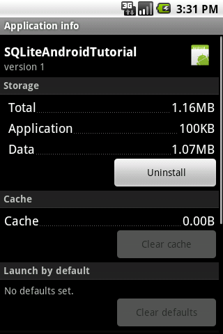

!SLIDE bullets incremental transition=fade

# Storage Methods #

!SLIDE bullets incremental transition=fade

# System Preferences #

* +Easy To Use
* -Not good for large amounts of data
* -Not good for storing binary data

!SLIDE bullets incremental transition=fade

# JSON #

* +Key mappings to Disk Locations
* +Simple to implement
* +Easy to Manage
* -Increases app size (if data in flash)
* -Consitency Issues (if data on SD Card)

!SLIDE bullets incremental transition=fade

# SQLite #

* +Provides Consistency
* +Everything stored in single file
* +Can contain binary data
* +ORM Solutions (3rd party)
* -Need to write DB code
* -Android does not have a baked in ORM

!SLIDE center transition=fade

# Before We Get Started #

!SLIDE bullets

# SQLite Tutorial Notes #

* Using default database storage location (flash)
* Storing images in the database as Blobs
* Pictures are fairly large (100KB / picture)

!SLIDE center

# SQLite Tutorial Notes #

